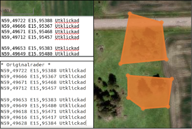
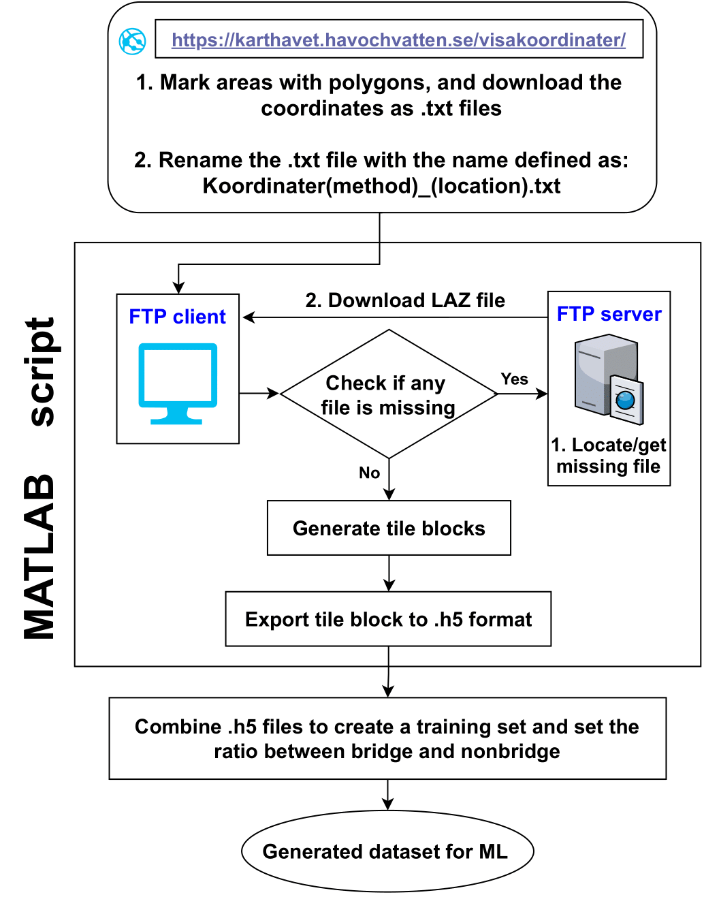
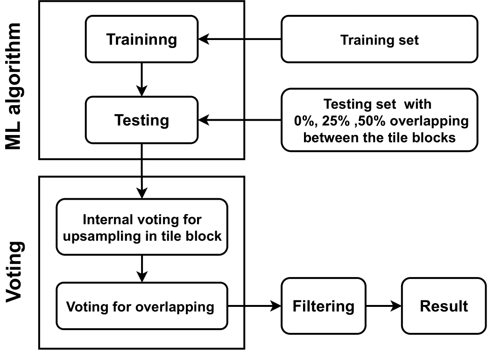

# BridgeDetectionALS

This project is our thesis work for Lantmäteriet. The purpose of this work was to use machine learning for bridge classification in point clouds. The code is not optimized and it is not designed for production purposes. This work was more focused to find the potentials of using ML for point classification in ALS data.

The ML algorithm used in this work was PointNet++. There was two parts of this work one was collect and generate training data for the ML algorithm. The second part was to train up the ML algorithm, test it and analyse the results. The following content is just a description for how to use the code, if you want to understand the concepts of this work please read the report ... (There will be a link when the report is published)

## Part 1 - data collection and generation

MATLAB was used for the data collection, there are two main scripts used for the data generation (generateTrainingData.m and combineH5.m). The script generateTrainingData.m is used to download point clouds in LAZ format from Lantmäteriets servers. The data is then generated to grids (tile blocks) in h5 format. The data is from laserdata skog and cover only areas within Sweden, for more info checkout:

https://www.lantmateriet.se/sv/Kartor-och-geografisk-information/geodataprodukter/produktlista/laserdata-nedladdning-skog/

To generate training data three steps are need:

### 1. Download polygons over the selected area.

Go into the webpage: 
https://karthavet.havochvatten.se/visakoordinater/

The mark the polygones over the areas, where you want your dataset to be. When the area have been marked download the polygone as text file format. There are 4 types of generation methods to specify which one for each file the names of the downloaded text file must be changed. The first part of the file name must contain "Koordinater", then the generation method numbers, here are two examples: 

_Koordinater1_bridges_Lund.txt_ or _Koordinater13_bridges_Lund.txt_

Here is a short description of each generation method:
1. Generate only tile blocks that contains bridge points, for the entire LAZ files.
2. Generate only tile blocks that do not contains bridge points, for the entire LAZ files.
3. Generate tile blocks that are only within the marked polygone.
4. Generate tile blocks over the whole LAZ files and take overlap between tile blocks as an input parameter. This method is designed for generation of test sets.

To generate training set we only used generation method 1 and 3, since method 2 generates to large areas. There is also posible to generate multiple polygones within one text file as long as the original coordinates is copied from the web page and replaces the content under "originalrader" to indicate which points that is in the same polygone by adding blank rows.

### 2. Use generateTrainingData.m to collect and generate the data over the selected polygones.

First make sure that you have an account to download the data from Lantmäteriet. It is free and it can be done on this website:
https://opendata.lantmateriet.se/#register

There are three parameters for the generated data:
The side length of the tile blocks.
The number of points per tile block.
The overlap between the tile block, this setting is only supported while using generation method 4.

Run the script when the parameters have been selected, when the file dialog appear select the text files that contains the selected polygones. The first time you download the LAZ files over the selected area you have to login with username and password to the server, a message will appear on the command prompt so you can write it there. Otherwise it is possible to hardcode the username and password into the script "getMissingFilesFromServer.m". When the LAZ files have been downloaded they will be saved on the computer so they do not have to be downloaded the next time.

It might take a long time to generate the data since the functions is not optimised and make sure that you have enough memory on the computer if you are going to generate a large data set.

### 3. Use combineH5.m to shuffle and combine the generated training data.

Run the script then a file dialog will appear so you can choose the h5 files. Then your training set is ready to be used for the ML algorithms. 

## Part 2 - ML

Python was used one the ML part. For the usement of PointNet++ Linux is required, but the analysis functions works fine on windows. When you are using PointNet++ make sure that you are using computer with a GPU with a high performance, otherwise the training will take a very long time. For the ML part the first step is to set up PointNet++, the second is to train up the algorithm, the third is to run the test script and the last is to analyse the results.

### Set up PointNet++

### Train up a model

To train up a model, go to the folder:
Python->Train

Then open train_seg.py and specify the training parameters.

1. Number of features, set "pointFeatures = []" for no more features than the XYZ coordinates. To use one feature set "pointFeatures = ["intensity"]" or "["return_number"]". To use both features set "pointFeatures = ["return_number", "intensity"]".
2. Number of points
3. Max epoch
4. Batch size

There are even more parameter for in this script and in the model scripts ("pointnet2_part_seg_(3,4,or 5)Features.py") in the folder
"Python->ML_Algorithms->pointNET2->part_seg".
That can be used for the training.

Then run the script, for us it took around 4 days to train up a model with a training and validation set of 34 km² with a point density around 1.5 point per m². When the training is finnished the models will be saved in the folder Python->TrainedModels. Move or rename the folder of the trained model if you want to save it, otherwise it will be overwritten in the next training.

### Run the test set

To run the trained model in the test set go to the folder Python->Test. Specify the parameters in "evaluation_seg.py" and select the trained model, then run the python script. After it is compleate a copy of the testset will be added to the folder results. It will contain the prediction of each point in the tile blocks.

### Analyse the results

Specify the files to analyse, voting, filter parameters, and the output folder of the results in "analyse_test_results.py", then run the script. You will receive classification scores, coordinates over predicted bridges, histograms that indicate the quality of the predicted bridges, and point cloud views of the prediction.

